<h1 align="center">snapgrep</h1>

<p align="center">
  An in-process trigram index that makes code search in <a href="https://github.com/earendil-works/pi">Pi</a><br>
  <b>20–70× faster than ripgrep</b> — with results that are byte-for-byte identical.
</p>

<p align="center">
  
</p>

<p align="center">
  No sidecar process. No daemon. A single 3.2 MB native addon loaded inside the agent process.
</p>

## Why this exists

Coding agents search constantly. Every `grep` call in a large repository means ripgrep reads every byte on disk again — hundreds of milliseconds, several times a minute, forever.

Index-backed search fixes that, but the usual answer is a sidecar daemon (Zoekt, and everything built on it): another process to launch, supervise, keep in sync, and debug when it drifts. For a CLI agent that starts and stops constantly, that is a lot of machinery.

snapgrep puts the whole index in the agent's own process. Rust builds and queries a trigram index over a git snapshot; Node calls it through N-API. Startup to first query is about half a second, and the index is smaller than the code it indexes.

## Measured results

All numbers are P50 over 7 measured iterations after 3 warmups, kernel and ripgrep alternating within the same run, on the same repository snapshot with identical query parameters and output limits.

### Against ripgrep

| Query | snapgrep | ripgrep | Speedup |
| --- | ---: | ---: | ---: |
| Rare token, 1 match in 4,000 files | 0.120 ms | 230.8 ms | **1921×** |
| Escaped regex, 1,200 matching files | 3.188 ms | 220.2 ms | **69×** |
| `createServer` in a 17 MB repo | 2.065 ms | 147.7 ms | **72×** |
| `defineConfig`, 186 candidate files | 2.574 ms | 142.9 ms | **56×** |
| `import\.meta`, 538 candidate files | 4.179 ms | 156.5 ms | **37×** |
| Path-filtered search | 0.973 ms | 8.0 ms | **8×** |

The last row matters most: once a path filter has already narrowed ripgrep's work, the index advantage shrinks. Speedup comes from skipping files, so it tracks how many files ripgrep would otherwise have to read.

### Against Zoekt

Zoekt is the reference index-backed engine. Every query that snapgrep serves from its index is at least twice as fast, measured against Zoekt in the same run:

| Query | snapgrep | Zoekt | Ratio |
| --- | ---: | ---: | ---: |
| Glob filter `*.yaml`, 800 files | 1.533 ms | 70.4 ms | 0.022 |
| Case-insensitive, 500 files | 3.003 ms | 51.8 ms | 0.058 |
| Glob filter `*.ts` | 3.053 ms | 14.8 ms | 0.206 |
| Case-insensitive `defineConfig` | 4.806 ms | 13.8 ms | 0.347 |

Zoekt's per-query cost is dominated by HTTP transport, JSON decoding, and re-verification across a process boundary. Removing the process boundary removes all three.

### Footprint

| | Synthetic 17.0 MB corpus | Real 17.4 MB repository |
| --- | ---: | ---: |
| Index size | 6.5 MB (0.38× source) | 15.9 MB (0.91× source) |
| Cold start to first query | 662 ms | 508 ms |
| Resident processes | 0 | 0 |

## Correctness comes first

Every result set is checked against ripgrep on the same snapshot with the same flags. The bar is `missing = 0 && extra = 0` — and also identical ordering, byte offsets, context lines, and truncation behaviour.

**24 of 24 queries match ripgrep exactly.** That has held on every accepted change.

Anything the index cannot serve *correctly* falls back to a full ripgrep search rather than returning a partial answer. Fallback is reported in the result metadata with a reason, so an unsupported query never looks like an empty result.

Currently falling back:

- Binary files where ripgrep's NUL-byte output semantics apply
- Regex combined with path or glob filters
- Literals shorter than 3 bytes, or spanning line breaks
- Case-insensitive search with a non-ASCII pattern
- Glob syntax outside the proven subset (`!`, `?`, `[]`, `{}`)

These are correctness boundaries, not missing features. Each one is a case where matching ripgrep's exact behaviour has not been proven yet, so the index refuses to guess.

## Install

Copy the packaged extension into your project:

```sh
mkdir -p .pi/extensions
cp -R artifacts/pi-extension/pi-fast-grep .pi/extensions/
pi --approve
```

Or install it globally:

```sh
mkdir -p ~/.pi/agent/extensions
cp -R artifacts/pi-extension/pi-fast-grep ~/.pi/agent/extensions/
pi
```

Pi's built-in `grep` is replaced automatically. To confirm it is active, search for a string you know exists — the tool detail will show `actualBackend: kernel`.

The prebuilt binary targets macOS on Apple Silicon. On other platforms the extension reports exactly which native file is missing instead of failing silently; build from source with `npm run build:kernel && npm run package:extension`.

中文安装说明见 [安装说明.md](artifacts/pi-extension/pi-fast-grep/安装说明.md)。

## Staying fresh

An index is only useful if it reflects what you just edited.

Before any tool that can modify files runs, in-flight searches are drained and the index is invalidated. After the tool finishes, the index is rebuilt from the current working tree. A search can therefore only ever observe a complete state — never a torn one, mid-edit.

Measured recovery on a 300-file repository: **41–62 ms** from edit to searches running on the index again. Two consecutive `edit` calls and one `bash` call were each followed by a search that returned to the index and matched ripgrep exactly.

While a rebuild is in flight, searches fall back to ripgrep. Correct, just not accelerated.

## How it works

```
Pi (Node)                         snapgrep (Rust, same process)
┌────────────────┐   N-API     ┌──────────────────────────────┐
│ grep tool      │ ──────────► │ trigram index over a git     │
│                │ ◄────────── │ snapshot, mmap'd             │
└───────┬────────┘             └──────────────┬───────────────┘
        │                                     │ candidates
        │ unsupported query,                  ▼
        │ or index rebuilding      ┌────────────────────────┐
        ▼                          │ in-process exact verify│
   ripgrep (full search)           └────────────────────────┘
```

1. Split the pattern into trigrams and intersect their posting lists to get candidate files.
2. Apply hidden / path / glob / case filters at the candidate level, before any file is read.
3. Verify exactly, in-process, over the mmap'd index — no subprocess, no re-read from disk.
4. Materialize only the lines actually needed for the requested limit and context.

The index is a single file per repository, built from a clean git snapshot, with content blocks compressed and gram metadata delta-varint encoded.

## Development

```sh
./scripts/bootstrap.sh      # pins dependencies, builds, runs the test suite
npm run check               # type check
npm test                    # unit and integration tests
npm run test:kernel         # native tests against the real addon
npm run benchmark           # correctness and performance harness
```

Requires Node 22.19+, Rust, and ripgrep on `PATH`.

Benchmark result artifacts from the most recent accepted rounds are in [`artifacts/results/`](artifacts/results/), including the correctness runs, the same-run A/B no-regression measurements, and the delivery readiness numbers quoted above.

## Method notes

Two measurement rules this project learned the hard way, both worth stealing:

**Never compare against a P50 recorded in an earlier run.** Re-measuring the same unchanged code across sessions drifted by −31% to +9% — enough to manufacture a regression that does not exist, or hide one that does. Every no-regression check runs both versions in the same process batch, alternating ABAB, each with its own warmups.

**A 5% threshold is meaningless on a query that does no work.** For searches with zero candidate files, 5% is about 4 microseconds — below timing noise. Running two byte-identical builds against each other showed exactly how much noise each class of query carries, and the thresholds were set from that measurement: absolute microsecond bounds for near-zero-work queries, the relative 5% bound for everything else. That calibration immediately caught a real 5 µs regression caused by an added per-instance property changing V8's object layout.

## License

MIT
